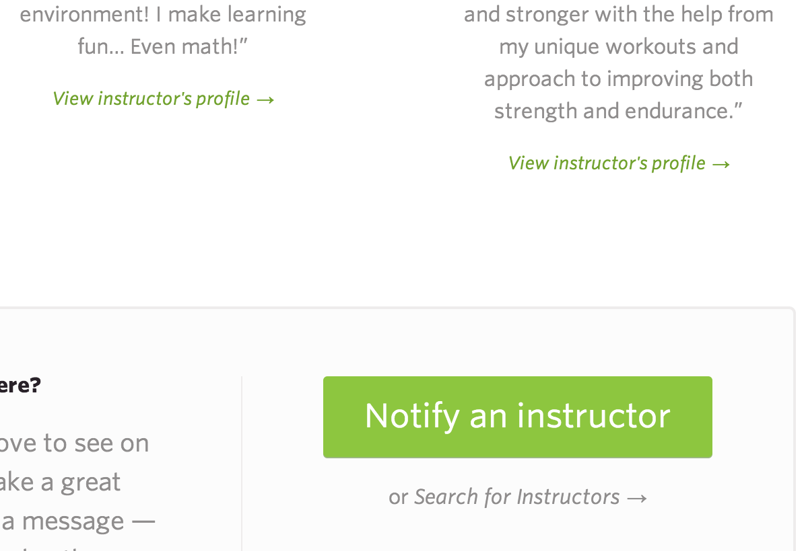
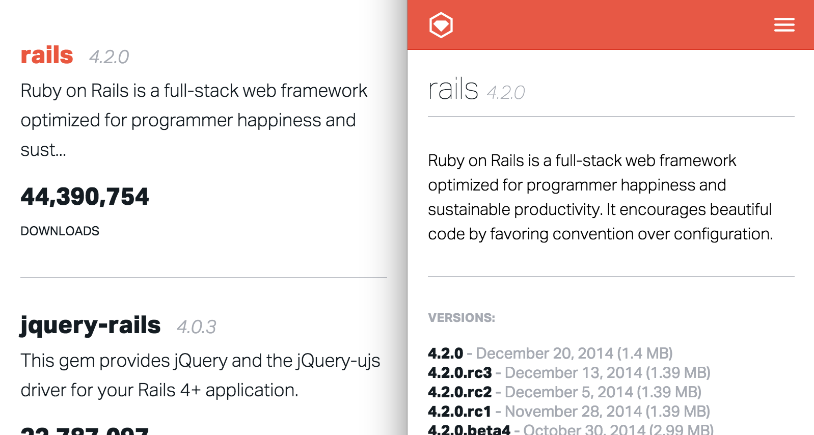
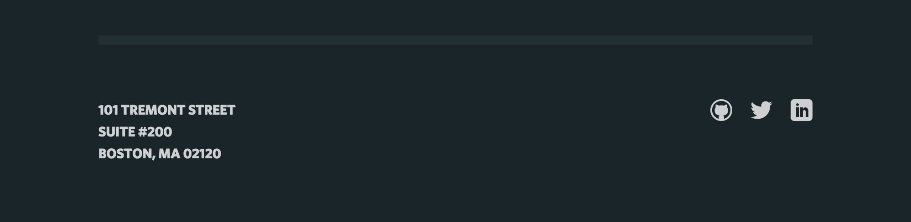

# Class Naming Conventions

## No IDs for Style Hooks

Don’t use IDs to attach visual and interactive styles to elements.
Everything that needs style can be done without IDs. Avoid usage
because of their heightened specificity. For more, refer to
[CSS Wizardry’s “Pain in the class” blog post]
(http://csswizardry.com/2011/09/when-using-ids-can-be-a-pain-in-the-class/).
Only use IDs for
[fragment identifiers]
(http://csswizardry.com/2011/06/namespacing-fragment-identifiers/#fragment-identifiers).

## BEM Naming Conventions

Use `.block__element--modifier` syntax for naming classes. Refer to
[CSS Wizardry’s MindBEMding blog post]
(http://csswizardry.com/2013/01/mindbemding-getting-your-head-round-bem-syntax/)
and the
[BEM website]
(https://bem.info/method/definitions/).

* Double underlines for child elements of a block.
* Double dashes for modifiers.
* Single dash for multiple words. Example `.club-sandwich`, which
  refers to a three-bar nav icon. Others may call it a hamburger menu.
* [Avoid chaining modifiers]
  (http://reefpoints.dockyard.com/2015/01/05/avoid-chaining-modifiers.html).

## Prefixes

* `.is-` for state changes, which follows
  [SMACSS state rules]
  (https://smacss.com/book/type-state).
  Most common use cases: is-active (Example: `.nav__link.is-active`
  when a nav link is highlighted to show that it is the current page)
  and is-hidden (hides content visually, but allows screen readers like
  VoiceOver to still read it. There are many different ways of hiding
  text, but so far below is the way that works in the most cases even
  though there is a
  [performance hit]
  (http://www.zeldman.com/2012/03/01/replacing-the-9999px-hack-new-image-replacement/)).

      .is-hidden {
        position: absolute;
        left: -9999px;
        text-indent: -9999px;
      }

* `.has-` for shared styles.
  
  Here, there are mulitple elements that have shared styles of pseudo
  after classes with an arrow (→). In this case, both would have classes
  of `.has-arrow`.
* `.l-` for layout styles modified from
  [SMACSS layout rules]
  (https://smacss.com/book/type-layout) to only include grid layout
  styles such as wraps, columns, and overflows.
* `.t-` for text styles like text color, display text: `.t-display` and
  paragraph text: `.t-text`.

## Suffixes

* `--r` for right side. Example: `.l-col--r` would style a column that
  often would be positioned on the right side of a page. This does not
  have to be true when the screen narrows down to mobile phone width.
* `--l` for left side.
* `--s` for size small.
* `--m` for size medium.
* `--b` for size big (didn’t want it to be `--l`, which would
  be confused with left). Example:

      .l-wrap--s,
      .l-wrap--b {
        margin-right: auto;
        margin-left: auto;
        width: 90%;
      }

      .l-wrap--s {
        max-width: 640px;
      }

      .l-wrap--b {
        max-width: 1020px;
      }

  If three sizes aren’t enough, we can use xs, s, m, b, xb.

## Common Patterns

1.  Same content on index and show / detail pages
    
    On the left is the gems index of RubyGems.org and on the right is the
    detail page of a gem. Elements such as the gem name, gem version and gem
    summary are all repeated content that are styled in different ways. Body
    / parent classes should be used to scope styles. In this case, the
    element containing the word "rails" would be called `.gem__name` and it
    would hold styles in common. If we need to target a specfic `.gem__name`,
    we would style it by nesting (`.gems .gem__name` on the index page and
    `.gem .gem__name` on the show / detail page).

1.  Plurals should be used when possible for groups of items.
    [Here is a JS bin to illustrate this pattern.]
    (http://jsbin.com/cusese/2/embed?html,css,output)
    
    Here is a footer with socials links. The group of social links would be
    called `.socials`, each item is a `.social` and if you need specific
    style on the Twitter icon, it would be called `.social--twitter`. We
    would rather use its singular form (`.social`) rather than call each
    item `.socials__social`. This is sometimes referred to as the
    [Plural Parent Pattern]
    (http://codepen.io/jlong/pen/IzpEJ/).
